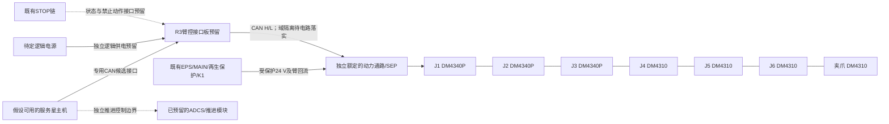

# R3：B601接口与整星数字装配

用户已同意按本轮方案直接推进数字装配，并在后续用提示词调整。当前没有采购实物；“服务星主机可连接”是明确的设计假设。

本轮保留现有结构和推进候选路线，把既有 **85×70×40 mm** 机械臂电控代理舱位细化成 **60×40 mm PCB预留、4组接口包络和2条局部功能线路**。B601的7个电机节点在关节内已含驱动器；舱内新增内容是控制/通信/供电交接的空间设计。接口板没有元件电路，也未选MPN；0.8 kg仍是旧预算，不从新几何体积生成虚构重量。

全系统组成、已有预留和五个决策见项目文档：[服务星系统组成与设计决策](../../01_project/competition/服务星系统组成与设计决策_R3_20260920.md)。

## 文件

| 文件 | 可用范围 |
|---|---|
| `native/SERVICE_STAR_SERVICE_R3.SLDASM` | R3当前服务态整星入口；以最终`results/NATIVE_ASSEMBLY_DELIVERY.json`为原生构建/冷打开依据 |
| `native/EQUIPMENT_GROUP_R3.SLDASM` | 细化电控舱位的装配组，保留其余原件 |
| `native/B601_INTERFACE_RESERVATION_R3.SLDPRT` | 8实体预留件；颜色仅为可视标识；没有物理材料与整件质量赋值 |
| `cad/B601_INTERFACE_RESERVATION.step` | 独立可导入STEP，与`.step.py`参数化源同名；无需R1/R2即可查看局部设计 |
| `inputs/BOARD_RESERVATION.json` | 舱位、PCB孔位、接口包络等数字设计参数 |
| `docs/B601_JOINT_MAP.csv` | J1–J6及夹爪的候选型号族、CAN/反馈ID |
| `docs/PROPOSED_INTERFACE_PINS.csv` | 本项目定义的逻辑针位，**不是OEM接头物理针号** |
| `docs/CABLE_CONNECTION_PLAN.csv` | 12条连接记录；是R2相关链路的细化/补充导航，不直接累加采购数量 |
| `results/RESERVATION_STATIC_CHECK.json` | STEP实体、体积、原舱位包含关系及三固定态外部干涉检查 |

整星原生文件是本工作区增量：需要保留R1和R2的native目录，不能仅移动R3文件夹就宣称跨机可用。完整整星装配未新增运动配合，未完成所有线缆的三维布线或材料赋值。本轮不修改R1/R2封存件。

## 连接架构

动力电源不经过一块尚未选型的信号PCB细铜线。R2的A07–A10、C01–C04端点和网络在本轮逐条继承；不改变K1、再生制动及主/AUX回流边界。R3-JLOGIC供电电压未定，不能把24 V动力母线直接接入逻辑端。R3-JSAFE只是接口位置和信号职责预留，不给现有STOP输入短接、旁路或自动复位。

CAN按单一干线设计，两个物理末端负责终端网络；实际关节/分离板/USB-CAN桥是否已内置终端尚未确认，因此不再盲加7个终端。终端阻值、启用位置、总阻抗、共模回流与屏蔽接壳，列为接线放行前核验。主机CAN参考域和臂功率回流不在本轮自行短接；隔离/网关模块在后续电路中落实。

## 已核实的版本差异

- B601仓库锁定提交`9f767783d761a8be0e9bb6fbc5ef1ae09fd68bbb`的BOM为3×DM4340P(V4)、4×DM4310(V4)。SDK锁定提交`40ab6ce58fec3c58cb603efb3f30240d6f5849e4`给出J1–J3为4340P、J4–J6及夹爪为4310；指令ID1–7，反馈ID0x11–0x17。
- 本地DM4310 V1.1和DM4340P V1.0手册说明驱动器内置、24 V与CAN接口。它们不自动成为V4受控手册；旧参数导出的UV15/OV32、TIMEOUT0及SDK增益不下发、不视作已验证安全限值。
- 设计CAN候选为1 Mbit/s（旧电机手册与Seeed达妙说明）；SDK README的SocketCAN示例为500 kbit/s存在来源差异，串口921600 baud也不是CAN位率。数字接口可以先保留1 Mbit/s要求，采购后必须让主机、桥接器和所有关节统一为实际支持的同一位率。
- SDK配置中的`rate:500`不是7节点整链500 Hz已验证时序。R3不设置运行频率或改软件增益；终端数、总线负载、反馈模式、故障重发与看门狗需要一起冻结。
- B601 BOM线材参考包为350 mm两端弯头2根、350 mm一弯一直1根、200 mm两端弯头3根、200 mm定制两端直头1根；这些长度不等于当前服务星切长。R3局部几何的OD3/R2只用于显示走线空间，不能继承成这套OEM线材的弯曲额定值。

原始来源：[锁定B601 BOM](https://github.com/Seeed-Projects/reBot-DevArm/blob/9f767783d761a8be0e9bb6fbc5ef1ae09fd68bbb/hardware/reBot_B601_DM/readme_zh.md)、[SDK关节配置](https://github.com/vectorBH6/reBotArm_control_py/blob/40ab6ce58fec3c58cb603efb3f30240d6f5849e4/config/rebotarm_dm.yaml)、[Seeed达妙说明](https://wiki.seeedstudio.com/cn/damiao_series/)。下载、旧手册来源和本地依赖均有SHA256记录。

## 推进和后续修改

推进此前已考虑：共用ADCS/推进包络110×160×75 mm、供电/数据路线、候选贸易研究和分配检查器都已存在。本轮整星继续保留这些部分；真实喷口数、位置/方向、湿/干质量、阀驱动和脉冲能力尚未绑定。该部分可继续做空间和控制接口设计，不能显示成已选定、可点火或可在轨消旋的推进实装。

后续提示词可以直接指定：“将R3接口板改成70×45”“把主机接口改为隔离CAN”“为选定推进模块更新舱位与安装面”。当前是冻结尺寸的可编辑源：部分尺寸仍在CAD源和独立校核式中明确给定，修改时需同步参数表、源代码及校核，不能只改JSON就假定所有几何自动更新。修改尺寸或路径后要重跑几何检查；改变真实电源、器件或线型后要重新核对电气参数。当前交付是可以继续编辑的数字设计，不是PCB加工、线束制造或实物运行许可。
