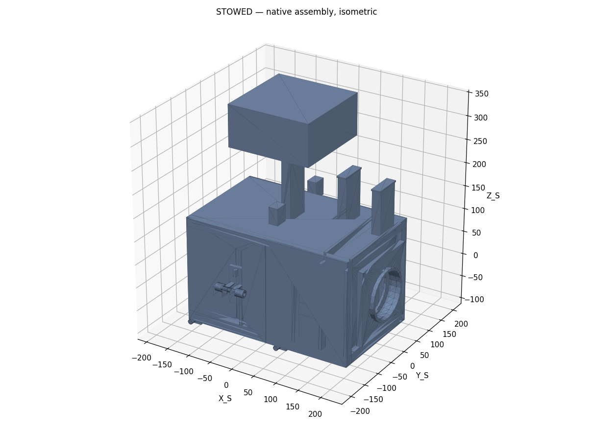
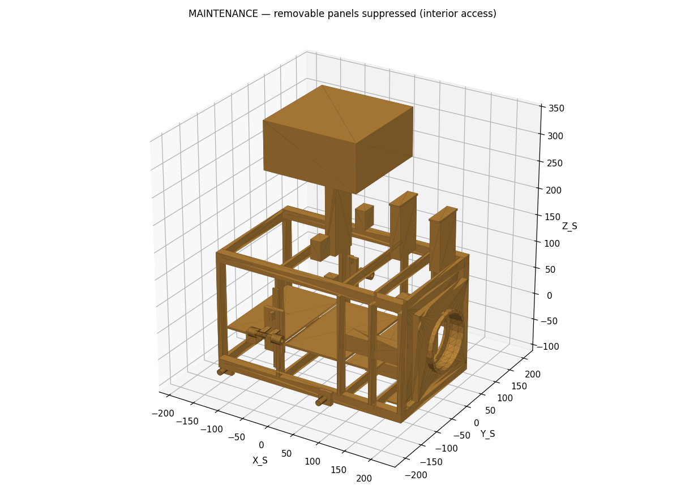
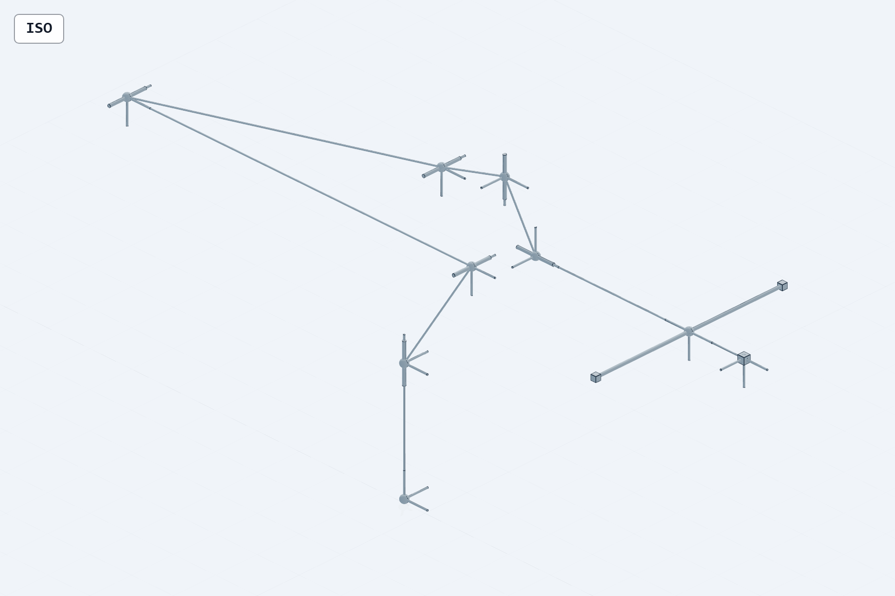
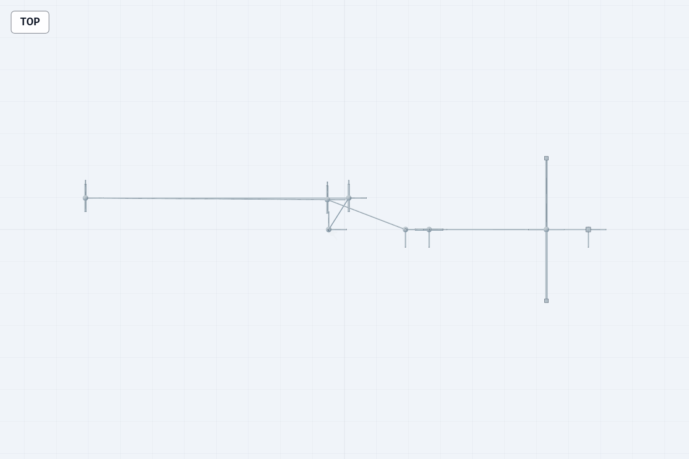
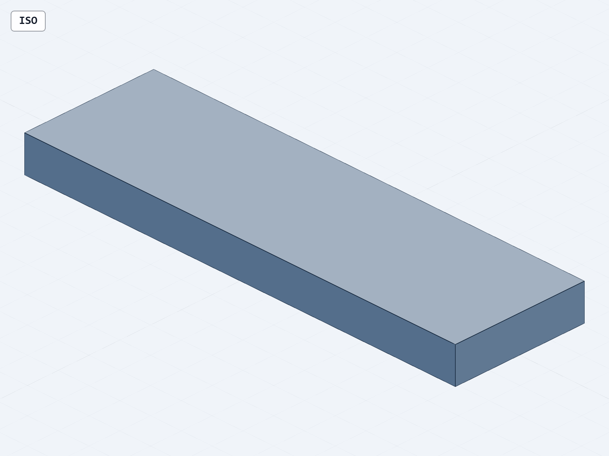
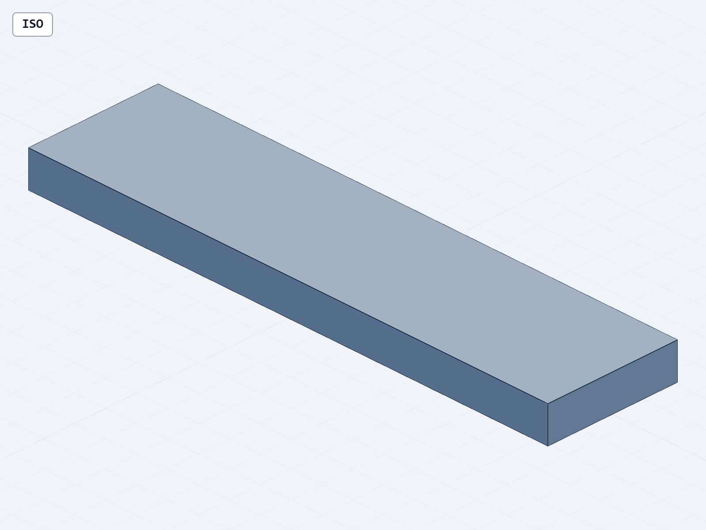

# B5.1R1 Phase 1 当前机械设计效果与装配证据图册

日期：2026-08-01  
任务：`COMP-PROT-03-A4-B5.1R1-PHASE1`

## 0. 原生单坐标系冷重开持久化结果

本轮一次性诊断件
[B51R1_SINGLE_CS_DIAGNOSTIC_COPY.SLDPRT](../00_BASELINE/DIAGNOSTIC_ONLY/B51R1_SINGLE_CS_DIAGNOSTIC_COPY.SLDPRT)
已经在全新 SolidWorks 2024 进程中冷重开，并在唯一一次受控 `Save3` 后正常关闭。当前 SHA-256 为
`D55277E924B56F76EFA3682C7628B8FE841172792280E0FE57CDE4A90E3A4ABD`。

在 20 秒可见证据窗口内，Codex 任务 UI 中可见 SolidWorks 特征树内唯一的
`CS_DIAGNOSTIC_ONLY` 以及对应三轴显示；但项目目录中没有持久化截图文件，
因此该画面不取得截图信用。本 Gate 通过依据是强类型 API 回读与不可变收据，
并不要求截图。

当前可复核的原生诊断结果为：

- 全新进程中精确存在 1 个 `CS_DIAGNOSTIC_ONLY`，类型为 `CoordSys`；
- 坐标变换旋转矩阵为 identity；
- 平移为 zero；
- scale 为 `1`；
- 外部文件引用数为 `0`；
- Stage A SHA-256 前后均为 `5DEBE5AF52A896CDC3818ADD645725A8E758DB4E5D76F46E3067F9FAA7B5C76B`；
- 关闭后文档数为 0，SolidWorks 进程数为 0；
- [正式单坐标系 Gate](../07_VERIFICATION/B51R1_SINGLE_CS_DIAGNOSTIC_GATE.json)
  为 `SINGLE_COORDINATE_SYSTEM_PERSISTENCE_PASS`。

不可变证据：

- [冷重开收据](../07_VERIFICATION/B51R1_SINGLE_CS_DIAGNOSTIC_COLD_REOPEN_RECEIPT.json)，SHA-256 `534316819A07D7204764511A4732C99C172311CE26935156AF6AE129DA06CA0D`；
- [冷重开变换回读](../07_VERIFICATION/B51R1_SINGLE_CS_DIAGNOSTIC_TRANSFORM_COLD_REOPEN.json)，SHA-256 `3BCA317E99629143326020FBCF7D5923680E9E1196A1A423FFEAFA062403C731`；
- 冷重开进度日志 SHA-256 `24A7ABC64C53492B8B4A014627874F2045539BB3D723073F4D794D1BEE646B2D`。

目标文件在受控保存前 SHA-256 为 `6B571B49D440BBDC723566FA97224C69AFABCBA6BAC34DCF4036A5F4037E120C`，保存后变为 `D55277E924B56F76EFA3682C7628B8FE841172792280E0FE57CDE4A90E3A4ABD`。坐标系语义不变量未变，字节级差异原因未进一步解析，不得把该变化解释成几何或动力学变化。

边界：该诊断件不是最终 `B51R1_MASTER_SKELETON_V2.SLDPRT`、原生 Carrier、
原生运动装配或工程图。冷重开授权已经消耗完毕；后续原生 CAD 构建必须取得
新的、独立的 Phase 2A 可见启动授权，不能从本次 PASS 自动外推。

## 结论

当前可展示内容包括 V2.2 隔离参考整星、维护开舱参考视图、B601
`10 links / 6R + 1 fixed + 2 independent P` 的 q0 Carrier 中性见证，以及
G07/G08 鞋底 source-bound footprint 见证。

当前仍不存在通过 Gate 的
`B51R1_B601_NATIVE_ARTICULATED.SLDASM`、整星顶层原生装配或对应 B5.1R1
工程图。以下图片只能按各自证据层级使用，不能组合成“原生可运动整机已完成”
的结论。

## 1. V2.2 隔离参考整星

用途：说明已验收参考整星的总体构型、主结构和上部服务载荷布局。  
边界：它是只读 donor/reference，不是 B5.1R1 原生运动闭合结果。

用途：说明可拆面板、内部框架和维护通路的参考关系。  
边界：可拆面板不取得 B601 主承力路径信用。

参考工程图：

- [NATIVE01_STOWED.SLDDRW](../00_BASELINE/V2_2_NATIVE_CANONICAL_108_FILE_COPY/drawings/NATIVE01_STOWED.SLDDRW)
- [NATIVE01_MAINTENANCE.SLDDRW](../00_BASELINE/V2_2_NATIVE_CANONICAL_108_FILE_COPY/drawings/NATIVE01_MAINTENANCE.SLDDRW)

这两张图属于 V2.2 参考基线，不是 B5.1R1 新装配图。

## 2. B601 q0 Carrier 中性拓扑见证

本轮已直接复核四张现有快照：

- 图片均可正常读取，模型未裁切；
- q0 frame chain 可追踪；
- 末端双 P 分支在轴测图中可见；
- 图片不含逐 link/joint 文字标签，也不含精细工程外形。

控制证据：

- [q0 STEP witness R2](../03_CAD/10_KINEMATIC_CARRIERS/B51R1_CARRIER_Q0_STEP_WITNESS_R2.step)
- [q0 witness Gate](../03_CAD/10_KINEMATIC_CARRIERS/B51R1_CARRIER_Q0_STEP_WITNESS_R2_GATE.json)
- [快照视觉复核](../07_VERIFICATION/B51R1_CARRIER_Q0_R2_SNAPSHOT_VISUAL_REVIEW_20260730.json)
- [Carrier register](../04_CONFIGURATION/B51R1_CARRIER_REGISTER.csv)
- [URDF–Carrier frame mapping](../04_CONFIGURATION/B51R1_URDF_CARRIER_FRAME_MAPPING.yaml)

边界：这是 q0 frame/topology/axis 的中性见证；原生 Carrier 零件仍为
`0/10`，原生 Mate、限位、同文档回 q0、冷重开和 T005 均未运行。

## 3. G07/G08 鞋底 footprint 见证

这些简化体用于证明四个鞋底 footprint 的 source-bound 几何范围和持久引用，
不是详细 G07/G08 支架、HDRM、紧固件或柔顺垫设计。它们不授予接触自由度、
预紧、连接、主承力路径或发射约束信用。

## 4. 当前原生 CAD 与图纸缺口

| 工件 | 当前状态 |
|---|---|
| 单坐标诊断冷重开持久化 | `SINGLE_COORDINATE_SYSTEM_PERSISTENCE_PASS` |
| Stage A Master Skeleton 原生参考几何 | 同会话只读重开 PASS |
| 最终 `B51R1_MASTER_SKELETON_V2.SLDPRT` | HOLD，不存在 |
| 10 个原生 Carrier `.SLDPRT` | `0/10` |
| Carrier 原生装配 | 不存在 |
| `B51R1_B601_NATIVE_ARTICULATED.SLDASM` | 不存在 |
| `B51R1_SPACE_EMBODIED_ROBOT_INTEGRATION.SLDASM` | 不存在 |
| B5.1R1 新工程图/PDF | 未生成 |
| H9 | `UNRESOLVED_HUMAN_DECISION_REQUIRED` |
| H10 | `0/28` |
| T005-A/B/C | `NOT_RUN` |
| 机械—控制正式交接文件 | `0/8`，`NOT_RELEASED` |

后续六个机械工程闭环的执行图已准备但未授权：
[B51R1 Phase 2 机械工程执行图](B51R1_PHASE2_MECHANICAL_ENGINEERING_EXECUTION_MAP_20260801.md)，
SHA-256 `722773988310A166EE8F006E16C2D1B934D82E68A35B35734AB83EDF8CA3AB90`。

因此本图册可用于“当前设计与证据进度”展示，不可用于
`COMPLETE`、`MANUFACTURING_READY`、`FLIGHT_READY` 或
`LAUNCH_QUALIFIED` 声明。
