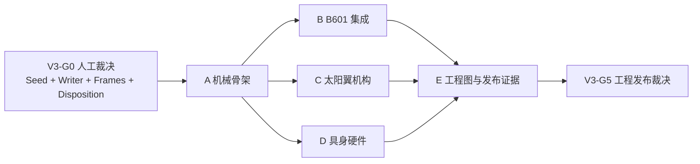

# SER-MECH-V3.0 机械设计执行计划

## 1. 总体目标

建立一套：

- 构型可解释；
- 接口可追踪；
- 质量不重复；
- 状态可验证；
- 失败可回退；
- 证据可复算；

的空间具身智能服务航天器机械模型。

V3.0 的工作对象不是“把方块换得更像”，而是把每个实体绑定到唯一功能、唯一 authority、唯一接口责任和可复核 Gate。

## 2. 当前起点

`MECHANICAL_ARCHITECTURE_RESET_COMPLETE`

同时保持：

- `V3_SEED=PENDING_HUMAN_RULING`
- `V3_CAD_AUTHORING_NOT_AUTHORIZED`
- `NATIVE_MECH_REAL_01_STAGE2_HOLD`
- `B601_TRUTH_BOUND / PHYSICAL_INTEGRATION_OPEN`
- `NATIVE_GEOMETRY_EXISTS / ENGINEERING_CLOSURE_NOT_REACHED`

## 3. 程序依赖

任何下游工作包都不得绕开上游 Gate。文档和接口模板可以提前准备；原生几何创建只能在对应 Gate 后开始。

## 4. V3-G0 — Authoring 入口 Gate

### 必须输入

- 候选 A 或 B 的 seed 人工选择；
- 唯一 writer 和工具版本；
- V3 根、顶装名、编号规则；
- `T_SM`、总长双轨和 25° clock/frame 裁决；
- Stage 2 失败资产处置；
- B601 三表征与第三方许可合同；
- 允许保留的负结果清单。

### 必须输出

- `V3_G0_HUMAN_RULING.yaml`
- `V3_SOURCE_ADMISSION_MANIFEST.yaml`
- `V3_WRITER_AUTHORITY.yaml`
- `V3_CONFIGURATION_CONTRACT.yaml`
- `V3_UNKNOWN_AND_NEGATIVE_RESULT_REGISTER.yaml`

### Gate

`V3_G0_AUTHORING_AUTHORIZED`

没有该 Gate 时，后续所有 CAD 路径均保持不存在。

## 5. Work Package A — Mechanical Skeleton

### A1. 新根与引用隔离

拟创建：

- `00_Master_Skeleton/`
- `01_Primary_Structure/`
- `Assembly/Space_Embodied_Service_Spacecraft_V3_0.SLDASM`
- `evidence/A_skeleton/`

要求：

- 从选定 seed 做“复制—引用修复—全树验证”，不改源树；
- V3 active top 的所有 production references 必须位于 V3 根内；
- third-party、URDF 和 STEP 只通过 manifest/受控 reference contract 进入，不形成隐式外链；
- 每次保存后执行冷重开、引用归属和 hash 检查。

### A2. Master Skeleton

Skeleton 只控制：

- S/M/A0/候选 clock frame；
- 总长与横截面命名轨；
- 三舱边界；
- B601 安装面和 keepout；
- 左右翼根轴、板根界面和 sweep keepout；
- 设备 bay、维护开口、线束走廊和硬点坐标；
- `238.3>226.3`、`302.3>226.3` 和 `STOW_Z_LIMIT=UNKNOWN`。

Skeleton 不控制：

- 未签发的材料、板厚、紧固件；
- 整星质量、CoM、惯量；
- 强度、刚度、模态或飞行安全。

### A3. 主结构

V3 对象分解：

- 5 个环框；
- 4 个独立纵梁实例；
- 3 个设备甲板；
- 6 个可拆面板；
- B601 载荷扩散节点；
- 左右翼根反力节点；
- launch/rail interface reference；
- volume/reference equipment owners。

每个对象必须带：

- `OBJECT_ID`
- `GEOMETRY_AUTHORITY`
- `MASS_AUTHORITY`
- `STRENGTH_AUTHORITY`
- `MANUFACTURING_AUTHORITY`
- `SOURCE_OBJECT`
- `SOURCE_HASH`
- `INTERFACE_OWNER`
- `STATUS`

### A4. A 出口 Gate

`V3_A_NATIVE_SKELETON_ACCEPTED_FOR_INCREMENTAL_DESIGN`

机器条件：

- V3 root 无外部 production reference；
- 无重复实例；
- 顶装冷重开；
- 所有正式配置存在并保持；
- 零未裁决实体互穿；
- 负结果和 UNKNOWN 完整；
- 全树 hash、dependency 和 deviation manifest 可复算。

人工条件：

- skeleton/frame/接口 owner 审核；
- 主结构仍缺载荷/材料时，只能批准：

`REFERENCE_PASS / PHYSICAL_STRUCTURE_HOLD`

## 6. Work Package B — B601 Integration

### B1. 接口责任链

V3 必须把以下责任链变成显式对象：

`B601/A0 → IF-RM-002 → adapter → M/IF-RM-001 → load-spreading frame → front frame → longerons → bus`

必须分别定义：

- 几何定位；
- 六自由度约束；
- 载荷 owner；
- 紧固/定位 owner；
- 维护拆装方向；
- 线束与连接器；
- 热/电搭接；
- 发射与运行状态。

### B2. 三表征合同

#### `B601_VISUAL_REVIEW`

- 几何源：vendor STEP/受控派生；
- 用途：外形、遮挡、维护和展示；
- 质量：必须排除；
- 运动学：不得自创关节；
- 分发：服从 `E3_INTERNAL_RESEARCH_ONLY`，未经许可不得对外。

#### `B601_KINEMATIC_CHECK`

- 唯一源：accepted URDF；
- 每个 link/joint 的名称、父子关系、axis、origin 和 limit 可追踪；
- 几何只需满足碰撞/姿态检查，不冒充高保真外形；
- 质量全部排除。

#### `B601_MASS_BUDGET`

- 唯一数值源：accepted URDF 的逐 link mass/CoM/inertia；
- 不允许体积反算、默认密度、字符串伪装或“总质量看起来一致”；
- 每个 link 的 mass、CoM 和完整惯量必须在 CAD/API 回读中成立；
- 如果 SolidWorks 不能无损表达某 link 惯量，则该表征保持 `HOLD`，继续以 URDF 为唯一 authority；
- 任何 top configuration 只能有一个 mass owner。

#### 互斥验证

每个配置回读：

- resolved component list；
- suppressed component list；
- BOM inclusion；
- CAD mass inclusion；
- URDF link coverage；
- external reference；
- total model mass；
- duplicate instance。

验收必须同时满足：

- active B601 physical instance = 1；
- active mass owner = 1；
- visual + kinematic + mass 不重复计重；
- HIFI/KINEMATIC/MASS 三配置不为空；
- 冷重开后状态不漂移。

### B3. Mount 与收拢支承

需要新的签发输入：

- 运行、捕获、发射、地面四类六维载荷；
- B601 允许安装载荷；
- 孔系、定位销、紧固件、预紧、材料、截面和公差；
- 三鞍座接触区、软垫、壳体允许压强；
- HDRM/发射锁定、释放方向和全路径；
- `STOW_Z_LIMIT`；
- 线束和维护工具轴。

O13 q 向量和三鞍座窗口保留为 comparator，不在输入闭合前升级为发布几何。

### B4. B 出口 Gate

`V3_B_B601_INTEGRATION_ACCEPTED`

至少要求：

- frame tree 唯一；
- mount ICD 签发；
- 三表征互斥与无重复质量通过；
- stowed/deployed/maintenance 全部冷重开；
- 运行和释放 sweep 无未裁决碰撞；
- 许可与 provenance 更新；
- physical TCP、任务接口未签发时明确保持 `UNKNOWN`。

## 7. Work Package C — Solar Mechanism

### C1. 对象架构

左右侧必须是两个独立、可追踪的子装配，不使用镜像后失去对象身份。

每侧至少按职责划分：

- root-to-bus interface；
- root base/yoke；
- hinge ears；
- through pin；
- bearing/bushing/retention；
- panel-root interface；
- torsion spring/actuator；
- hard stop；
- deployed latch（若采用）；
- HDRM bus-side；
- HDRM panel-side；
- release element；
- harness service loop/strain relief；
- maintenance/removal access。

现有“13 件/侧”只作现场库存事实；V3 BOM 必须重新按 physical/reference 对象计数，不能继承 9/14 的漂移数字。

### C2. 机构输入

必须签发：

- panel geometry、mass、CoM、inertia、stiffness；
- hinge axis、range、stowed/deployed datum；
- pin/bearing/retention interface；
- drive torque curve、preload、temperature、life；
- HDRM holding load、release shock、redundancy、reset policy；
- hard-stop load、rebound/latch behavior；
- harness bend/twist radius、cycle life and connector；
- root reaction into MID2/longerons；
- deployment time and damping；
- stowed X/Y/Z envelope。

### C3. 状态构型

正式构型：

- `STOWED`
- `DEPLOYED_NOMINAL`
- `DEPLOY_FAILED_BOTH`
- `L_FAIL`
- `R_FAIL`
- `PARTIAL_DEPLOYMENT`
- `MAINTENANCE`

要求：

- `L_FAIL`、`R_FAIL`、`PARTIAL_DEPLOYMENT` 必须有不同的可回读几何；
- comparator 配置不得伪装为发布状态；
- C5 与 302.3 mm 负结果必须显式关闭或保持 HOLD；
- `STOW_Z_LIMIT=UNKNOWN` 时不得宣称收拢合规。

### C4. C 出口 Gate

`V3_C_SOLAR_MECHANISM_ICD_AND_GEOMETRY_ACCEPTED`

机器条件：

- 左右对象与 BOM 一致；
- 真实自由度、止挡和逐态抑制持久；
- sweep、线束和 keepout 回读；
- 无隐藏/减薄制造的假通过；
- 负结果有裁决记录。

人工条件：

- 轴/轴承/弹簧/HDRM/止挡/线束/翼板/载荷全部有 owner；
- 缺任一关键输入则保持 `HOLD`。

## 8. Work Package D — Embodied Hardware

### D1. 任务硬件对象

V3-D 至少独立管理：

- `TASK_CAMERA`
- `RANGE_SENSOR`
- `WRIST_FT_SENSOR`
- `COMPLIANCE_OR_LOCK_STAGE`
- `TASK_TOOL_OR_GRIPPER`
- `PHYSICAL_TCP`
- `TARGET_INTERFACE`
- `EMBODIED_COMPUTE_TRAY`
- `POWER_DATA_HARNESS`
- `THERMAL_PATH`

### D2. 选型前规则

没有 datasheet、接口图、质量 owner 和审批记录时：

- 只允许 volume/reference；
- 不允许创建带真实硬件含义的实体；
- 不允许把显示 FOV 当标定 FOV；
- 不允许把 `E_virtual` 当 physical TCP；
- 不允许把 V2.0 OBC volume 当计算平台；
- 不允许由外形推断质量、功耗、热耗散或性能。

### D3. 必须形成的接口

- `T_SC`：task camera 到 spacecraft/arm 的标定 frame；
- `T_E_TCP`：末端到 physical TCP；
- F/T 安装栈、量程、刚度和标定；
- compliance/lock 的行程、刚度、阻尼、锁定状态；
- target interface 的接触面、容差、允许载荷和捕获序列；
- compute tray 的硬点、热接口、服务方向、供电和数据；
- arm/solar/FOV/RF/plume/thermal 联合 keepout。

### D4. D 出口 Gate

`V3_D_HARDWARE_INTERFACE_QUALIFIED_FOR_NATIVE_INTEGRATION`

未选型对象保持：

`VOLUME_REFERENCE / UNKNOWN_BLOCKED`

不得因为原生包络存在而升级为：

`PHYSICAL_HARDWARE_COMPLETE`

## 9. Work Package E — Engineering Drawings

### E1. 最低图纸包

- V3 总装 GA 与配置表；
- 总装 BOM 与 authority/mass-owner 列；
- 主结构爆炸图、三舱剖面、框架/纵梁/甲板接口图；
- B601 mount ICD、载荷路径、线束和收拢支承图；
- 左右翼根装配、铰链、轴承、弹簧、HDRM、止挡和线束图；
- 任务相机、F/T、工具、计算托盘和维护图；
- 零件图；
- fastener register；
- critical dimension/tolerance register；
- UNKNOWN/TBD 与 evidence-state 图。

### E2. 图纸规则

- 所有图只引用 V3 根；
- `NOT FOR MANUFACTURE` 与 released drawing 分开；
- 未签质量必须留空或明确 `MASS_AUTHORITY=EXCLUDED`；
- 不得显示默认密度产物为权威重量；
- BOM 必须能区分 physical、reference、envelope、analysis；
- 每张 PDF 导出后做标题栏、视图、尺寸和文字回读；
- 图纸与原生文件均入 hash manifest。

### E3. E 出口 Gate

`V3_E_DRAWING_PACKAGE_RELEASED`

没有材料、尺寸、公差、紧固、BOM、签审和回读时，不得使用 `RELEASED`。

## 10. 数字线程与状态验证

每个工作包都必须产出：

- `input_manifest.yaml`
- `source_hash_manifest.csv`
- `dependency_ledger.csv`
- `object_authority_map.yaml`
- `configuration_readback.json`
- `interference_or_keepout_report.json`
- `deviation_manifest.csv`
- `machine_verdict.json`
- `human_ruling.yaml`

Gate 状态只允许：

- `PASS`
- `HOLD`
- `FAIL`
- `UNKNOWN`
- `NOT_APPLICABLE`
- `NOT_AUTHORIZED`

禁止用：

- “文件存在”
- “脚本执行结束”
- “截图看起来正确”
- “总质量接近”
- “配置名存在”

代替验证。

## 11. 质量不重复控制

V3 顶装必须有单独的质量 owner ledger：

| 对象类 | CAD mass | 科学/预算 authority | BOM |
|---|---|---|---|
| primary physical structure | 仅在材料/密度/几何获准后启用 | 签发的 mass owner | include |
| B601 visual | exclude | none | reference-only |
| B601 kinematic proxy | exclude | accepted URDF | reference-only |
| B601 mass surrogate | 仅在逐 link mass/CoM/inertia 回读通过后启用 | accepted URDF | analysis-only |
| sensor/compute volume | exclude | none until selected | reference-only |
| keepout/envelope | exclude | none | exclude |
| third-party reference | exclude | none | exclude |

顶层任何配置的质量结论都必须同时报告：

- active mass owners；
- excluded reference owners；
- total；
- source hash；
- configuration；
- timestamp；
- cold-reopen state。

## 12. 终止条件

任一出现即停止当前 CAD 增量并发出 HOLD：

- 写入非 V3 根；
- 引用回指 V2.x 源；
- 出现未登记的新外部依赖；
- 代理重复、质量重复或配置为空；
- Gate 文本与机器证据不一致；
- 尺寸或 frame 冲突被静默覆盖；
- UNKNOWN/TBD 被默认值替代；
- 负结果被隐藏、抑制或删改；
- CAD 崩溃后无法证明保存边界；
- 许可证或分发边界不明确。

## 13. 下一步

当前唯一允许的下一步是人工签发 `V3-G0`。在该记录到位前，本计划不创建 `Space_Embodied_Robot_CAD_V3_0`，也不启动 SolidWorks。
