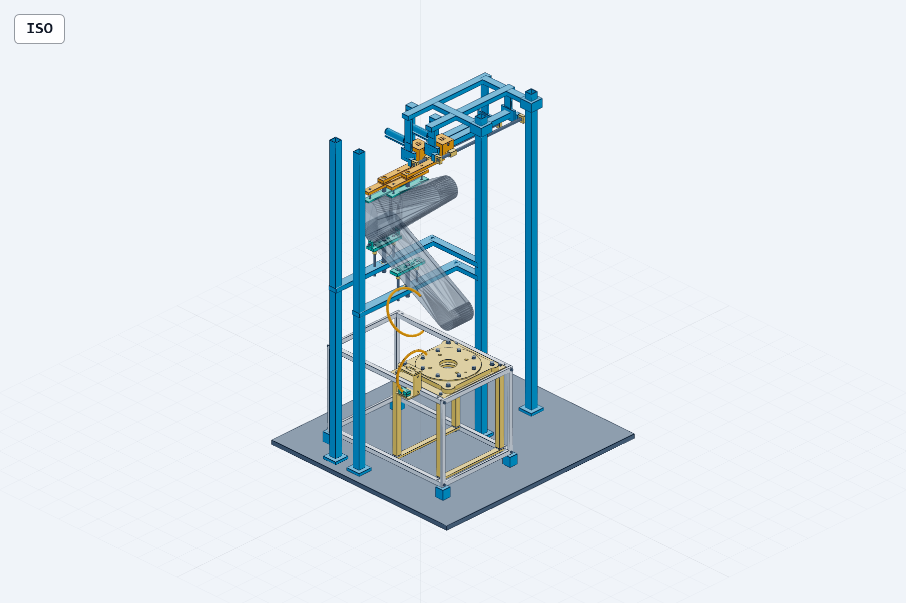

# WP02 根部—双鞍座—保持释放—线束关键组合件

已完成首轮可编辑零件化与数字试装：56份定制零件STEP，79项零件号BOM，保持/释放总装各224个实体，另有根部独立组合件、5页接口尺寸图与实物试装单。当前是地面装调候选；尚未完成实物装配、承载加工定型或飞行验证。

请先看 [设计评审](DESIGN_REVIEW.md)、[接口尺寸图PDF](drawings/WP02_INTERFACE_DRAWINGS.pdf) 和 [实物装配与验收单](ASSEMBLY_AND_ACCEPTANCE.md)。图中蓝色高框是可移除地面工装，灰色臂形是两个连杆凸包，曲线是线束几何代理。

## 文件入口

| 交付组 | 文件 | 已完成的内容 |
|---|---|---|
| 输入与实测登记 | [输入说明](INPUT_AND_MEASUREMENT.md)、[37项实测表](MEASUREMENT_REGISTER.csv)、[源文件记录](INPUT_PROVENANCE.json) | WP01基准、厂家固定版本和实测缺项分开记录 |
| 根部连接与载荷 | [根部STEP](root_connection.step)、[载荷路径](ROOT_LOAD_PATH.md)、[载荷工况](LOAD_CASES.json) | 桥板/梁/四柱/贯通拉杆/M3R、工具通道与条件柔度模型 |
| 双鞍座零件化 | [BOM](BOM.csv)、[零件目录](parts/)、[接触配准结果](results/CONTACT_REGISTRATION.json) | 两站可换垫、鞋、调整/让位及下退结构 |
| 保持释放机构 | [保持总装](key_assembly_held.step)、[释放总装](key_assembly_released.step)、[动作顺序](RELEASE_SEQUENCE.md) | 俘获销、导轨/滑块/丝杆、止挡、上下垫退出与状态接口候选 |
| 真实线束接入准备 | [线束设计](HARNESS_DESIGN.md)、[带臂/线束代理的总装](key_assembly_context.step) | 厂家连接器/总成条目核验、安装件与两段定长圆弧候选 |
| 运动与干涉 | [检查范围](MOTION_AND_CLEARANCE.md)、[覆盖表](collision_coverage.csv) | 三个滑台位置的实体配对、26臂姿态的固定工装检查及历史反例 |
| 图纸与装配 | [DXF](key_interfaces.dxf)、[图册](drawings/INTERFACE_DRAWINGS.html)、[试装单](ASSEMBLY_AND_ACCEPTANCE.md) | 5张源自真实BRep的投影尺寸图、P01–P06/V01–V13 |
| 证据与复现 | [交付回执](results/DELIVERY_RECEIPT.json)、[文件哈希](OUTPUT_SHA256.csv)、[复现说明](REPRODUCE.md) | 结果范围、来源保全、逐文件完整性与重算入口 |

## 当前机构与检查结果

- 臂根保持S=[90,0,125.15] mm；两站名义X=-115/-40 mm，B接触垫局部偏置+5 mm。
- 候选退出顺序：独立托持并卸载 → 锁销−X48 mm → 上垫+Z12、下鞋−Z30 mm → 两载台+Y180 mm → 双脱离确认 → 臂首动。
- 保持/释放各224个闭合正体积实体通过逐实体有效性检查；自相交检查未执行。三位置共14,400次宽相配对，22次需要Boolean窄相，未见正交叠体积；不是连续全行程证明。
- 26姿态×10臂link×28固定件共7,280配对，7,248严格包围盒分离、32三角裁剪，未见所检表面交叉。闭体包含、姿态之间、完整自碰及真实线缆仍未闭合。
- 25/25离线虚拟状态机场景符合预期；未选择/验证硬件传感器，未执行硬件动作。
- 当前高工装柱与90°翼板展开包络冲突。臂与翼的地面试验需分开布置，翼动作前转独立托持并移除相关工装。

## 实物接续次序

1. **根部尺寸试合**：确认实物DM版本、安装基准、孔模板和紧固件工具通道，记录实际孔系/朝向；四孔对称配准不等于已确定连接器朝向。
2. **空载机构试装**：先检验框架、滑台、销和垫退让的48/12/30/180 mm行程；补齐连接设计、导向配合、止挡与传感器。现模型标志片/支架间距23 mm，检测能力待实选。
3. **实际臂与线束试装**：取得link2下支承/link3上保持的允许承压区域，测线缆外径、尾壳、有效自由长与动态弯曲/扭转参数；在独立托持条件下按试装单回写实测结果。

厂家仓库资料已经接入，来源为[Seeed reBot-DevArm固定版本](https://github.com/Seeed-Projects/reBot-DevArm/tree/8def0ebd8ea0785dcbfc58c00ab176ee42acba5d)。其中200/350 mm是线束总成长度，不能直接代替模型的180/260 mm自由段长度。当前线束仍为HARNESS_PROXY_ONLY。

候选铝密度下随星结构几何估算2.529 kg、地面工装15.073 kg；这些数均不含完整紧固件质量，不是实测质量或整星质量。

## 本地查看

[三维总装查看器](http://127.0.0.1:3246/F:/China%20Graduate%20Future%20Flight%20Vehicle%20Innovation%20Competition/20_engineering/service_robot_wp02_20260905?file=key_assembly_context.step.py) 需要本机CAD Viewer进程运行；离线可直接打开STEP和PDF。所有参数与生成器在本目录，原WP01及既有研究裁决保留。

