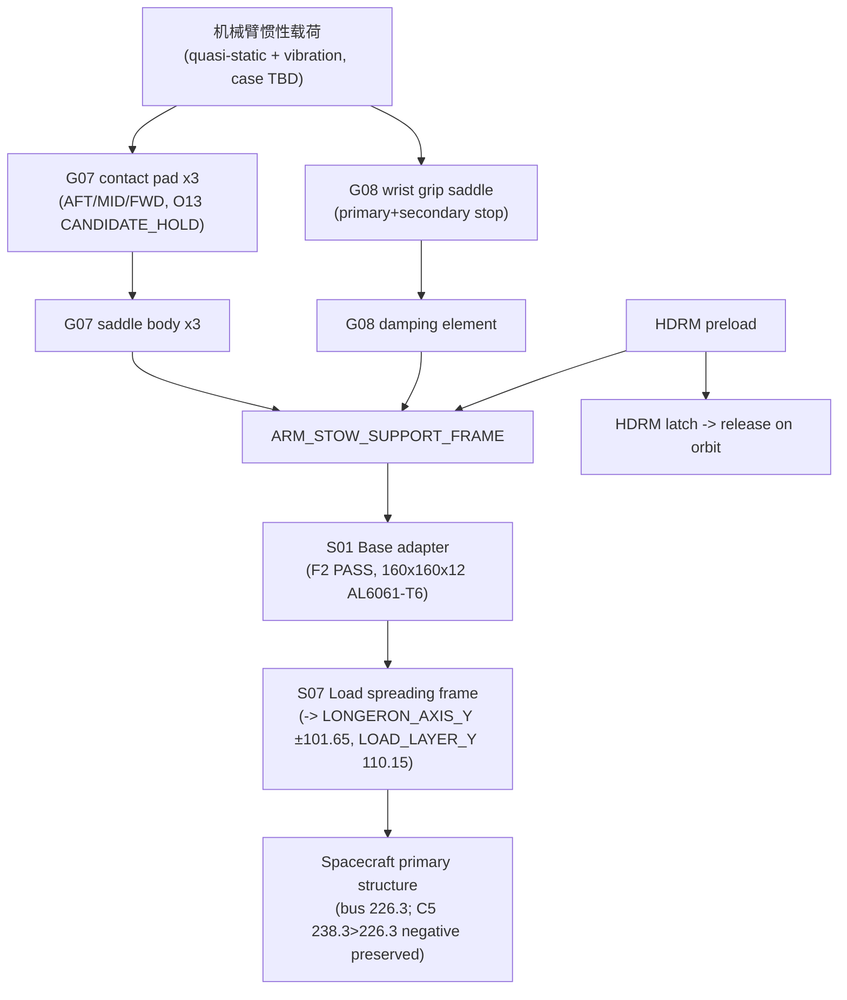
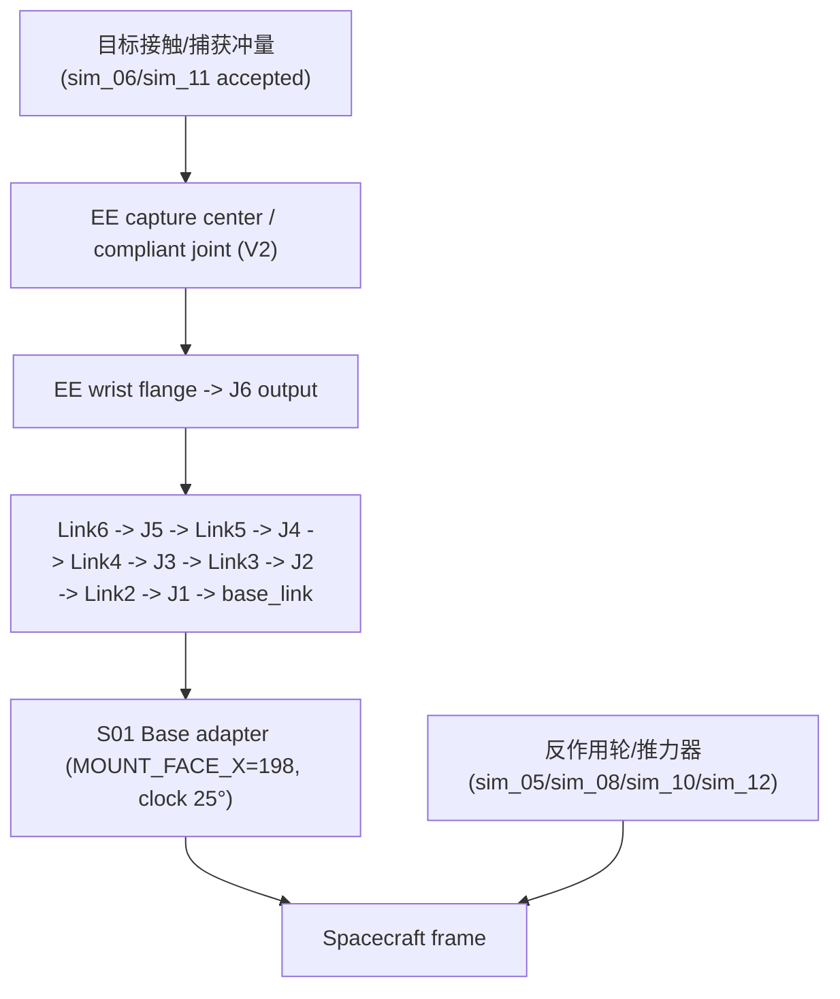
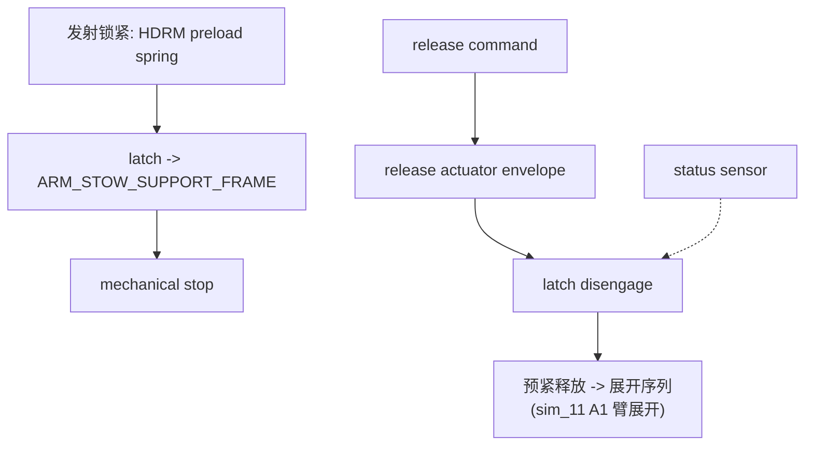

# 载荷路径分析 — B601 空间机械臂（F3-P0）

- 日期：2026-08-04
- 范围：三条主载荷路径，锚定 Master Skeleton 与 O13/C5/STOW_Z 真值
- 注：所有 `TBD` 项不得在裁决前默认为合规；`STOW_Z_LIMIT=UNKNOWN` 保持 UNKNOWN

## 路径 1 — 发射/收拢态（最易被攻击）

**关键判据（待闭合）**：
- 收拢 Z 包络 `STOW_Z_LIMIT=UNKNOWN` → 禁止判发射包络合规（D2）
- G07 接触面资格 `STOW_CONTACT_QUALIFICATION=HOLD` → G07 只能做几何候选（D4）
- C5 收拢包宽 238.3 > 226.3（超 12.0 mm）+ 翼根机构宽 302.3 → 负结果已入参，禁止覆盖
- G08 必须是 6-DOF 载荷路径（primary stop / secondary stop / preload / damping），不是"托住"

## 路径 2 — 在轨展开/捕获态

**关键判据**：
- 关节输出承载链 = 电机→减速器→输出轴→轴承→法兰→连杆，每段须在 JOINT_ICD 与零件模型中可追溯
- 捕获冲量 ≠ 消旋（sim_06：3°/s→3.06°/s）；推力器消旋预算见 sim_08（|H_c|=3.65 N·m·s = 12×轮组容量）
- 柔性反馈：sim_07 ANCF 帆板点捕获激振 vs 刚性 ≈92×；F3 柔性模型须与 sim_11 耦合口径一致

## 路径 3 — HDRM 释放

**关键判据**：HDRM 为 Engineering Candidate，非飞行型号；释放力裕度候选 1.5（D-候选）。

## F4 顶层集成准入判据（冻结）

进入 `SPACECRAFT_TOP_ASSEMBLY_FREECAD.FCStd` 前**全部**须 PASS：

- [ ] 10 link 制造模型（或 vendor 核心 BUY + 覆盖件裁决 D8）
- [ ] G07 / G08（F3-P2）
- [ ] HDRM（F3-P2）
- [ ] EE V1+V2（F3-P3）
- [ ] Base adapter（✓ F2 PASS）
- [ ] FREECAD_MASS_REGISTER 闭合（CAD 估计 vs URDF 双轨）
- [ ] URDF mapping（每个 MAKE 件标注几何/质量权威归属）
- [ ] 唯一顶层装配人工裁决 D3（已逾期 7 天）
